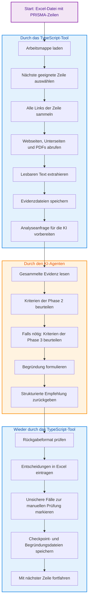

# PRISMA Analyser – Ablaufdiagramm

## 2) Ablaufdiagramm mit Farbcodierung

```mermaid
flowchart TD
    S[Start: Excel-Datei mit PRISMA-Zeilen]

    subgraph TOOL[Durch das TypeScript-Tool]
        T1[Arbeitsmappe laden]
        T2[Nächste geeignete Zeile auswählen]
        T3[Alle Links der Zeile sammeln]
        T4[Webseiten, Unterseiten und PDFs abrufen]
        T5[Lesbaren Text extrahieren]
        T6[Evidenzdateien speichern]
        T7[Analyseanfrage für die KI vorbereiten]
    end

    subgraph AGENT[Durch den KI-Agenten]
        A1[Gesammelte Evidenz lesen]
        A2[Kriterien der Phase 2 beurteilen]
        A3[Falls nötig: Kriterien der Phase 3 beurteilen]
        A4[Begründung formulieren]
        A5[Strukturierte Empfehlung zurückgeben]
    end

    subgraph TOOL2[Wieder durch das TypeScript-Tool]
        T8[Rückgabeformat prüfen]
        T9[Entscheidungen in Excel eintragen]
        T10[Unsichere Fälle zur manuellen Prüfung markieren]
        T11[Checkpoint- und Begründungsdateien speichern]
        T12[Mit nächster Zeile fortfahren]
    end

    S --> T1 --> T2 --> T3 --> T4 --> T5 --> T6 --> T7
    T7 --> A1 --> A2 --> A3 --> A4 --> A5
    A5 --> T8 --> T9 --> T10 --> T11 --> T12

    style S fill:#F3E5F5,stroke:#8E24AA,stroke-width:2px,color:#4A148C

    style TOOL fill:#E3F2FD,stroke:#1E88E5,stroke-width:2px,color:#0D47A1
    style TOOL2 fill:#E3F2FD,stroke:#1E88E5,stroke-width:2px,color:#0D47A1

    style AGENT fill:#FFF3E0,stroke:#FB8C00,stroke-width:2px,color:#E65100
```
